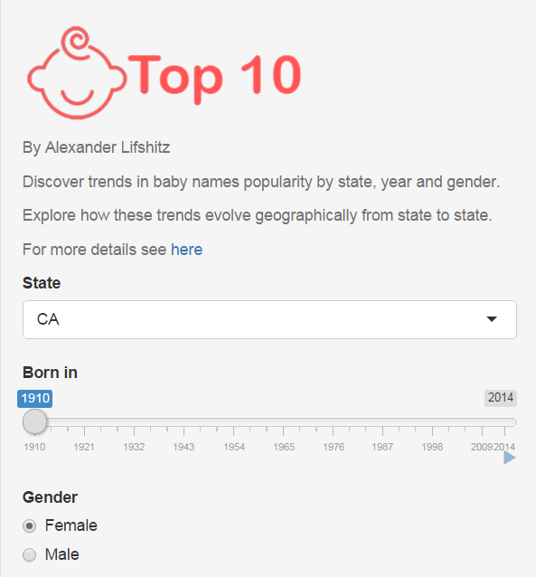
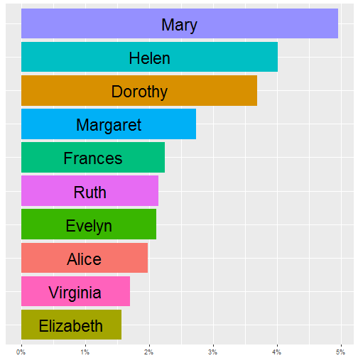
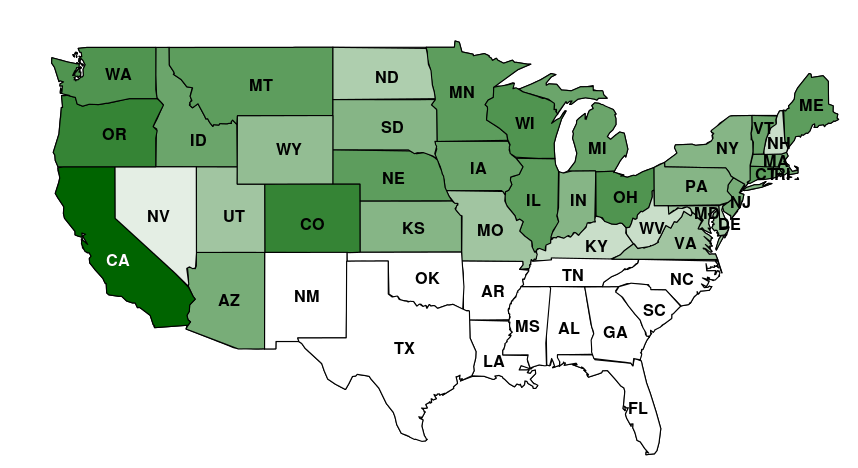

Top 10 Baby Names Explorer
========================================================
author: Alexander Lisfhitz
date: Sun Feb 28 16:49:49 2016


Introduction
========================================================

* <span style="color:red">Top 10 Baby Names Explorer</span> App allows users to explore baby names popularity in different US states since 1910 to 2014.
* The app shows top 10 baby names for a selected set of input parameters, and also shows a color-coded US map, which allows to compare popularity of these names across all US states.
* The app is available on shinyapps.io website ([link](https://datarocks.shinyapps.io/DP-project/))
* The interactive version of this presentation is also available on shinyapps.io ([link](https://datarocks.shinyapps.io/Top10BabyNames/))
* For this project we used US baby names dataset obtained from Kaggle ([link](https://kaggle2.blob.core.windows.net/datasets/13/13/files/StateNames.csv.zip))
 

Interactive User Interface
========================================================

* The app allows a user to interactively select US State, Year of Birth and Gender of the baby
* Let's assume for this presentation the following parameters

```r
SelectedState <- "CA"
SelectedYear <- "1910"
SelectedGender <- "Female"
```

***



Chart 1
========================================================
* The chart below shows Top 10 Female baby names born in  CA  in  1910




***

* It is interesting to note that the top 10 names accounted for 
27% of baby girls. By playing with the app one can note that with time diversity of names has increased dramatically.

Chart 2
========================================================

* <small>The chart below shows baby names popularity with respect to state  CA ( Female names, 1910 )</small>
* <small>The chart compares popular names in different states and visualizes how they compare to the selected state.</small>
* <small>Dark green areas correspond to high similarity with repect to the selected state, whereas light green or white areas correspond to low similarity.</small>

***


Appendix I - Names similarity metric
========================================================

* The following metric was used to compare names popularity between states 
<small> 

```r
my.dist <- function(list1, list2, n) {
## list1 and list2 must be ordered by popularity names lists (descending)
# Find rank differences of first n names of list1 vs list2
     a<-abs(match(list1[1:n], list2)-1:n)  
     a[is.na(a)]<-length(list2)
     a[a>=2*n]=2*n  # Limit the maximum difference to 2*n
     d1<-sum(a)/n   # Find average distance
# Find rank differences of first n names of list2 vs list1
     a<-abs(match(list2[1:n], list1)-1:n)
     a[is.na(a)]<-length(list1)
     a[a>=2*n]=2*n  # Limit the maximum difference to 2*n
     d2<-sum(a)/n   # Find average distance
#Make the metric symmetric, such that my.dist(list1,list2)=my.dist(list2,list1)
     d<-(d1+d2)/2   
     return(d)
}
```
.</small>
